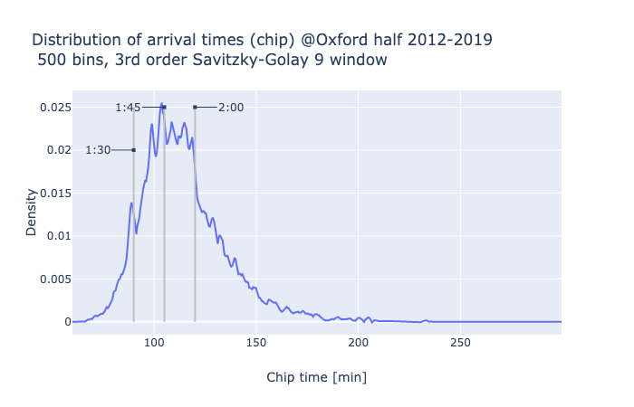
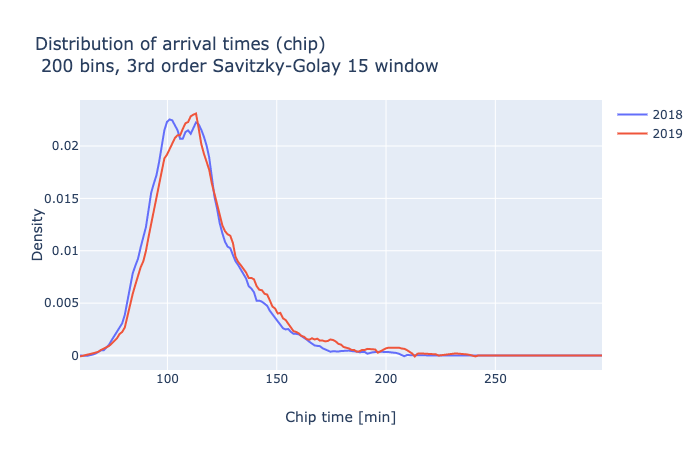

## Grabbed data for the Oxford half
This data is for a question for Giuseppe. Namely, is the MET decrease seen with aging decrease different in smaller runs.
It is scraped data that is not anonymised: please don't use it.
These are my notes.

## Ah! The rain!

A curious note. The distribution of finish times show peaks due to the athletes pushing themselves to finish before a nice round number. e.g. 2 hour.

Funny thing is that when it rained in 2019 the peak was shifted, relative to sunny 2018.

### 2012-2014
These three years are from the Oxford mail.
`.txt` is raw, `.csv` is parsed.

    import re
    for year in [2012,2013,2014]:
        bundle=open('Ox-{}.txt'.format(year),'r').read()
        with open('Ox-{}.csv'.format(year),'w') as w:
            w.write('Position, Name, Chip time\n')
            for m in re.findall('(\d+) ([\w\s\-\']+) (\d+:\d+:\d+)',bundle):
                w.write(','.join(m)+'\n')

### 2015-2019
Virgin seems to use a site `sporthive.com` for the data. The table calls an API which can get a max of 50 values each query.

    ## make the data copied from sporthive.com
    # 2019 6585475279125572096/races/468365
    # 2017 6551844572796185600/races/417503
    # 2018 6452506961398018048/races/435017
    # 2016 6182503241045465856/races/392137
    # 2015 6106029209426067456/races/369757
    import requests
    from time import sleep
    import csv

    req = requests.session()

    ongoing = True
    url = 'https://eventresults-api.sporthive.com/api/events/6585475279125572096/races/468365/classifications/search?count=50&offset={offset}'
    offset = 0
    data = []
    while ongoing:
        quinquagintuplet = req.get(url.format(offset=offset)).json()
        data.extend(quinquagintuplet['fullClassifications'])
        newbies = len(quinquagintuplet['fullClassifications'])
        if newbies != 50:
            ongoing == False
            break
        offset += newbies
        sleep(0.5)
        print(len(data))

    neodata = [{k: d['classification'][k] for k in d['classification'] if k not in ('splits',)} for d in data]

    with open('2019.csv','w', newline='') as fh:
        w = csv.DictWriter(fh, fieldnames=list(neodata[1].keys()), extrasaction='ignore')
        w.writeheader()
        w.writerows(neodata)

### 2015-2016
These data can be downloaded as `xlsx` from `sporthive.com`.
That is überkind of them. Maybe future datasets?
